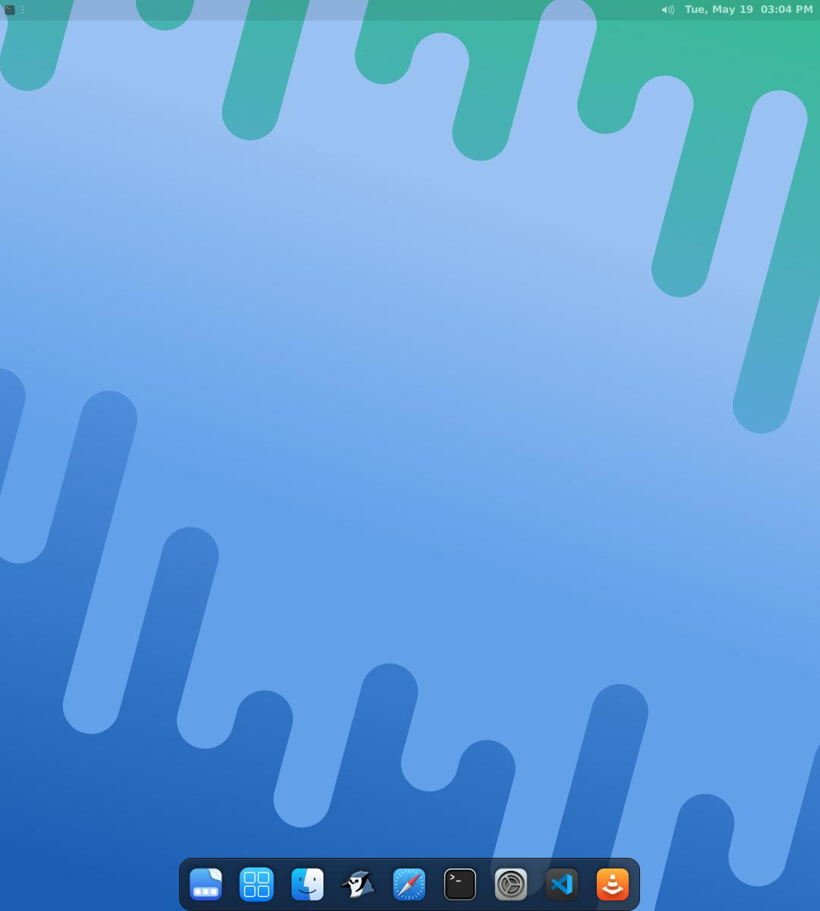
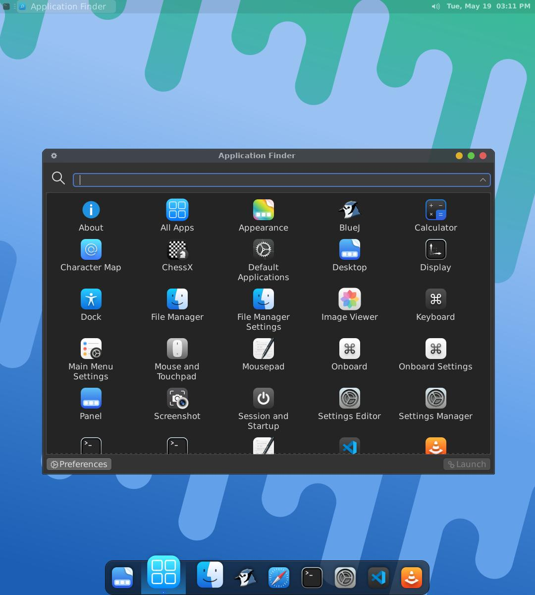
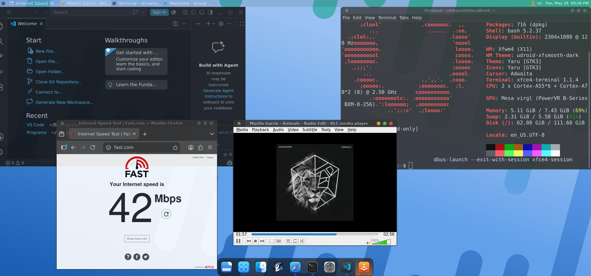
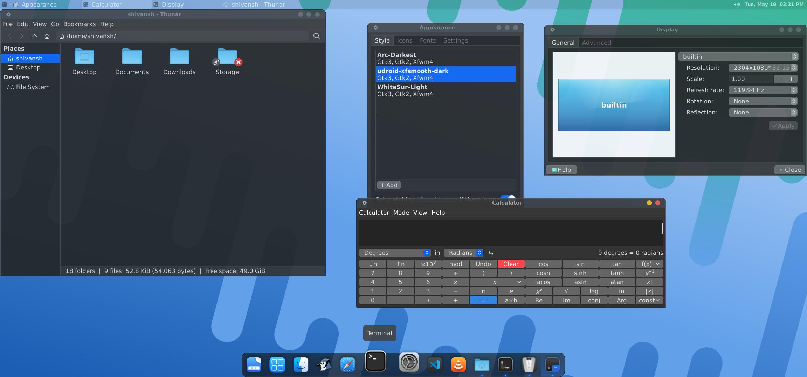
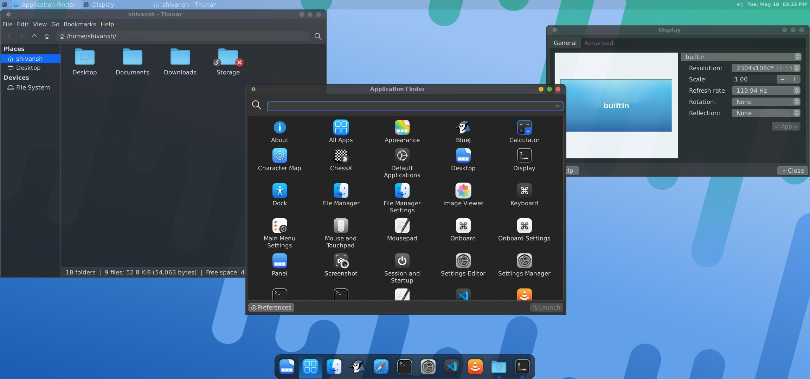
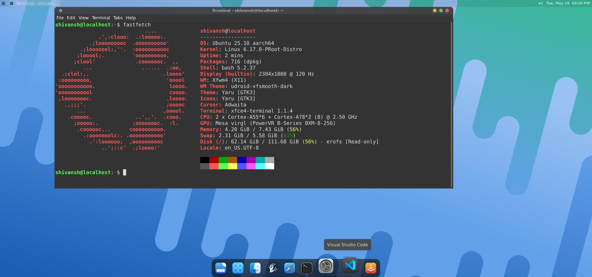

# UbuntuX 🚀

UbuntuX Lite is a lightweight and smooth Ubuntu XFCE desktop environment for Android built using Termux, Termux:X11, and Proot-Distro.

This project is created by **Shivansh Joshi (14 years old programmer)** with the goal of making Linux and programming accessible to students and users who cannot afford a PC or laptop.

UbuntuX transforms an Android phone into a portable Linux desktop with:

- Features ✨

- 🚫 No root required
- ⚡ Hardware accelerated graphics
- 🎵 Audio support with PulseAudio
- 🖥️ Smooth Termux:X11 desktop
- 🍎 macOS styled theme and dock
- 💻 VS Code support
- ☕ BlueJ support for Java learners
- 🔥 Lightweight and optimized XFCE desktop
- ❌ No VNC required
- 📦 One-command installation

---

UbuntuX is designed for:
- Students
- Programmers(Java, Python, Web Development etc.)
- Java learners
- Linux enthusiasts
- Users with low-end devices

The aim of UbuntuX is to provide a clean, fast, and easy Linux setup on Android so anyone can learn programming and use desktop Linux tools directly from their phone.

---

# Why UbuntuX? 🚀

UbuntuX is designed for:
- Programming on Android 
- Java development
- Web development
- Linux learning
- Lightweight desktop

Advantages:
- Cleaner macOS-like interface
- Hardware accelerated rendering
- Smooth desktop experience on Android
- Lower RAM usage
- Better responsiveness
- Smooth animations

---

## Programmer Friendly 👨‍💻

UbuntuX supports:
- VS Code
- BlueJ
- Firefox
- VLC
- More other apps...

### Perfect for:
- All programmers and coders.
- Support for Java, HTML, CSS, C++, C, C#, etc.

---
# Requirements
1. Termux
2. Termux:X11
3. 6

# Install Required Apps 📥

## 1. Install Termux

Download latest Termux apk (universal debug):

### GitHub
https://github.com/termux/termux-app/releases/download/v0.118.3/termux-app_v0.118.3+github-debug_universal.apk

> Do NOT install Termux from Play Store because it is outdated.

---

## 2. Install Termux:X11

Download latest Termux:X11 APK (universal debug):

### GitHub
https://github.com/termux/termux-x11/releases/download/nightly/app-universal-debug.apk

---

# Phantom Process Fix (IMPORTANT) ⚠️

Android 12+ kills Termux background processes using Phantom Process Killer.

This may cause:
- Signal 9 errors
- Termux getting killed in background
- XFCE suddenly closing
- VS Code crashing
- Audio stopping
- Ubuntu session randomly exiting

You should apply this fix before using UbuntuX.

---
# Pre-Installation Process (necessary)

- **Fix Using Wireless ADB (No PC Required)** 📱

## Install ADB AppControl Mobile

Download:
https://adbappcontrol.com/en/mobile/

Install the app on your Android phone.

---

# Enable Required Android Settings

Open:

```text
Settings → About Phone
```

Tap:
```text
Build Number
```
7 times to enable Developer Options.

Now open:

```text
Settings → Developer Options
```

Enable:
- USB Debugging
- Wireless Debugging

---

# Connect ADB AppControl

## Step 1
```text
Open The app and do the setup as directed in app and pair using
pairing code in notification
```

## Step 2 After connecting:
Open the:
```text
⋮ Three Dots Menu and open console
```

## Step 3
Copy-paste this command:

```bash
/system/bin/device_config put activity_manager max_phantom_processes 10000
```

Then press Enter.

---

# Restart Your Phone 🔄

After running the command:
- You can turn off Developer Options, Wireless Debugging, USB Debugging
  and uninstall **ADB App Control App**
- Restart your device once
- Open Termux again
- UbuntuX will work properly now

---

# Installation 🚀

## Setup Storage
```bash
termux-setup-storage
```
```bash
mv ~/storage/shared ~
```
```bash
rm -rf ~/storage
```
```bash
mv shared Storage
```

## Clone UbuntuX Repository

```bash
yes | pkg up
```
```bash
pkg install git -y
```
```bash
git clone https://github.com/techydude-ubuntux/UbuntuX.git
```
```bash
bash ~/UbuntuX/setup.sh
```

---

# What The Installer Does 🛠️

The setup script automatically:

✅ Installs Ubuntu using Proot-Distro  
✅ Installs XFCE desktop  
✅ Configures audio  
✅ Configures hardware acceleration  
✅ Installs themes and icons  
✅ Configures desktop environment  
✅ Sets up Linux user account  

---

# During Installation 👤

UbuntuX will ask you to create:

## Linux Username
Example:

```text
yourname
```

## Linux Password
Example:

```text
your password 
```

The installer automatically:
- Creates your Linux account
- Adds sudo support
- Configures startup files

---

# Optional Software Installation 📦

UbuntuX allows installing additional software during setup.Users can install one or multiple apps during setup.


Menu:

| Option | Software |
|---|---|
| 1 | Firefox |
| 2 | VS Code |
| 3 | BlueJ |
| 4 | VLC |

Example:

```text
Enter choices: 1 2 3 4
```

This installs all apps :
- Firefox
- VS Code
- BlueJ
- VLC

# Programming Languages Support 👨‍💻

UbuntuX also supports multiple programming languages and development environments.

You can install one or multiple languages during setup.

| Option | Programming Language | Description |
|---|---|---|
| 1 | Java | Popular language used for Android apps, desktop software, and enterprise development |
| 2 | Python | Beginner-friendly language used in AI, automation, scripting, and web development |
| 3 | C | Powerful low-level language widely used for system programming |
| 4 | C++ | Extension of C used in games, graphics, and high-performance applications |
| 5 | C# | Modern language mainly used for .NET applications and game development with Unity |
| 6 | JavaScript / Node.js | Popular language for web development and backend applications |
| 7 | HTML / CSS | Used for designing and building websites |
| 8 | PHP | Server-side language commonly used in web development |
| 9 | Go | Fast and lightweight language developed by Google for backend and cloud applications |
| 10 | Rust | Modern systems programming languag

Example:

```text
Enter choices: 1 2 3 4 6
```

This installs:

- Java
- Python
- C
- C++
- JavaScript / Node.js

UbuntuX provides a lightweight Linux development environment for learning, coding, compiling, and running programs directly on Android using Termux and Proot.

---

# Starting UbuntuX ▶️

After installation:

```bash
UbuntuX
```

UbuntuX automatically:
- Starts PulseAudio
- Starts Termux:X11
- Starts VirGL Hardware Acceleration 
- Launches XFCE desktop

---

# Exit UbuntuX

To close Ubuntu:

```bash
logout
```

---

# VS Code Fix 🛠️

If VS Code does not launch correctly 
Do right click on VS code and paste this in command section:

```bash
code --no-sandbox
```
---
# Termux:X11 Recommended Settings ⚙️

Open:

```text
Termux:X11 → Preferences
```

### Output
- Resolution Mode → `Custom`
- Resolution → `1080x1200`
- Filtering Mode → `Nearest`
- Adjust resolution to orientation → `OFF`
- Stretch to fit display → `OFF`
- Reseed screen while keyboard open → `ON`
- PIP Mode → `OFF`
- Immersive Mode → `ON`
- Screen Orientation → `Auto`
- Hide display cutout → `ON`
- Keep Screen On → `ON`

> Do NOT change pointer settings.

---

### Keyboard
- Show additional keyboard → `ON`
- Show keyboard with additional keys → `ON`
- Show IME with external keyboard → `OFF`
- Prefer scancodes when possible → `ON`
- Hardware keyboard scancodes workaround → `ON`

---

# Termux:X11 Extra Keyboard ⌨️

Open:
```text
Termux:X11 → Settings → Extra Keys Config
```

Paste:

```text
[['F1','F2','F3','F4','F5','F6','F7','F8','F9'],
['F10','F11','F12','HOME','END','TAB','ALT','CTRL','SHIFT'],
['UP','DOWN','LEFT','RIGHT','PGUP','PGDN','ESC','PREFERENCES','KEYBOARD']]
```

Save the preferences!

### Extra Key Bar Opacity → `50`

---

### Gestures
> In other tab of X11
- Three finger swipe up → Toggle soft keyboard
- Three finger swipe down → Toggle extra key bar

---

### Important
Disable these Android gestures:
- Three finger screenshot
- Three finger split screen

They may conflict with Termux:X11 gestures.

---

# Performance Tips ⚡

For best performance:

- Disable battery optimization for:
  - Termux
  - Termux:X11

- Keep at least:
  - 2GB free RAM
  - 6GB free storage

- Use Android dark mode

- Avoid aggressive battery saver modes

---

# Screenshots 📸

- Desktop
- 
- macOS Theme & Dock
- 
- 
- Installed Apps (VS Code, Firefox, VLC, etc.)
- 
- Utilities
- 
- 
- About OS
- 
---

# Credits ❤️

Projects used:
- Termux
- Termux:X11
- XFCE
- Proot-Distro
- VirGL
- Mesa

---

# Note:
Performance depends on:
- Device CPU
- RAM
- Android version

Some applications may behave differently compared to real Linux systems.

---

# License 📜

MIT License
